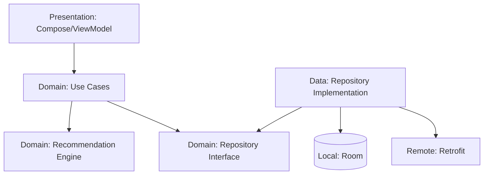

# RestaurantExplorer

A production-quality Android application for discovering and searching restaurants with personalized recommendations based on user preferences and location.

## 🚀 Architecture
The project follows **Clean Architecture** principles with a clear separation of concerns:



### 1. Presentation Layer (`presentation/`)
- **Jetpack Compose**: Declarative UI implementation.
- **MVVM Pattern**: ViewModels manage UI state using `StateFlow`.
- **Sealed UI States**: Robust state management (Loading, Success, Error).
- **Navigation Compose**: Type-safe navigation between screens.

### 2. Domain Layer (`domain/`)
- **Models**: Pure Kotlin data classes representing business entities.
- **Use Cases**: Small, focused classes representing single user actions (SRP).
- **Recommendation Engine**: Encapsulated logic for scoring restaurants based on user behavior and distance.

### 3. Data Layer (`data/`)
- **Offline-First**: Room database for local caching and history tracking.
- **Repository Pattern**: Single source of truth for data fetching and synchronization.
- **Mappers**: Conversion logic between Remote DTOs, Local Entities, and Domain Models.
- **Retrofit**: Network communication with a mock interceptor for local testing.

### 4. Dependency Injection Layer (`di/`)
- **Hilt**: Modern DI framework for providing dependencies like repositories and use cases.

## 🛠 Tech Stack
- **Kotlin**: Primary language with Coroutines and Flow.
- **Jetpack Compose**: Modern Android UI toolkit.
- **Room**: Local database for persistence.
- **Retrofit & OkHttp**: Networking.
- **Dagger Hilt**: Dependency Injection.
- **Coil 3**: Image loading.
- **Play Services Location**: Real-time user location.

## ✨ Features
- **Personalized Recommendations**: Smart scoring based on viewed/bookmarked cuisines.
- **Proximity Search**: Calculates distances and factors them into rankings.
- **Real-time Search**: Search with history and debounce logic.
- **Advanced Filtering**: Filter by cuisine, rating, price, and distance.
- **Offline Support**: Access cached restaurant data and bookmarks without internet.

## 📂 Folder Structure
```text
com.bansi.restaurantexplorer/
├── data/
│   ├── local/          # Room database, DAOs, and Entities
│   ├── remote/         # Retrofit API and DTOs
│   ├── mapper/         # Data transformation logic
│   └── repository/     # Repository implementations
├── domain/
│   ├── model/          # Business models
│   ├── repository/     # Repository interfaces
│   └── usecase/        # Focused business logic (Use Cases)
├── presentation/
│   ├── components/     # Reusable Compose widgets
│   ├── navigation/     # Navigation graph and routes
│   ├── theme/          # Material 3 colors and typography
│   └── [feature]/      # Feature-specific Screens and ViewModels
├── location/           # Device location management
└── di/                 # Hilt dependency injection modules
```

## ⚙️ Setup Instructions
1. Clone the repository.
2. Open in **Android Studio (Ladybug or newer)**.
3. Sync Gradle and ensure **JDK 17+** is configured.
4. Run the `:androidApp` configuration on an emulator or physical device.

---
**Built By:**
**Harsh Raghuwanshi**

---
